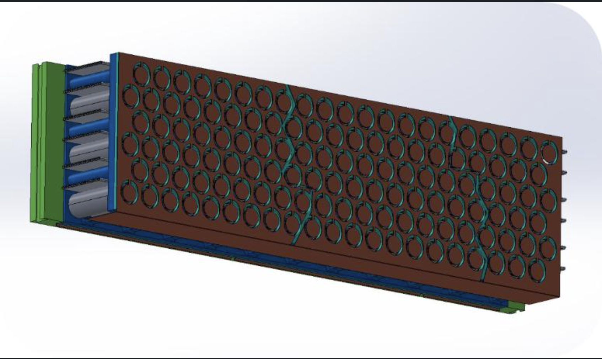
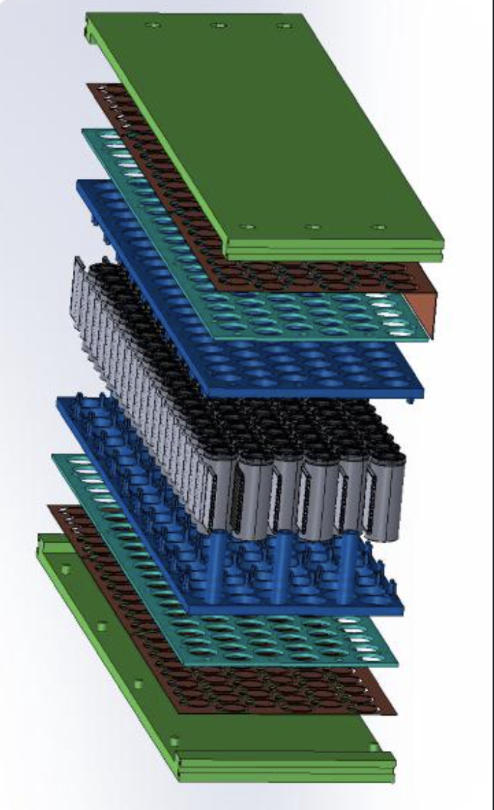

# EV Battery Pack Design (SolidWorks)

Designed and modeled an EV battery pack assembly in SolidWorks, including cell holders, thermal ribbon structures, and supporting frame components.

## Battery Assembly

## Exploded View

